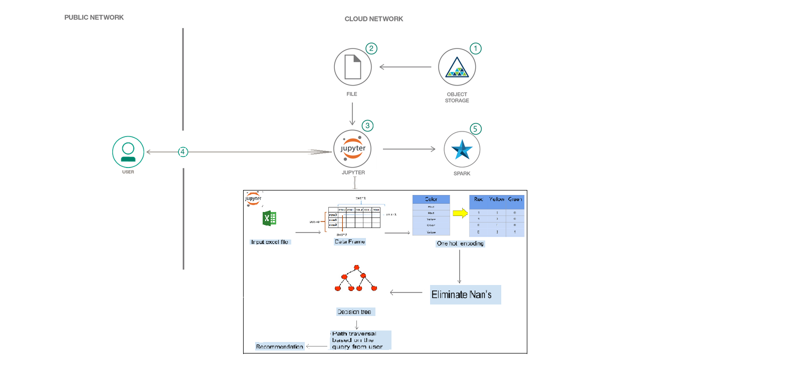
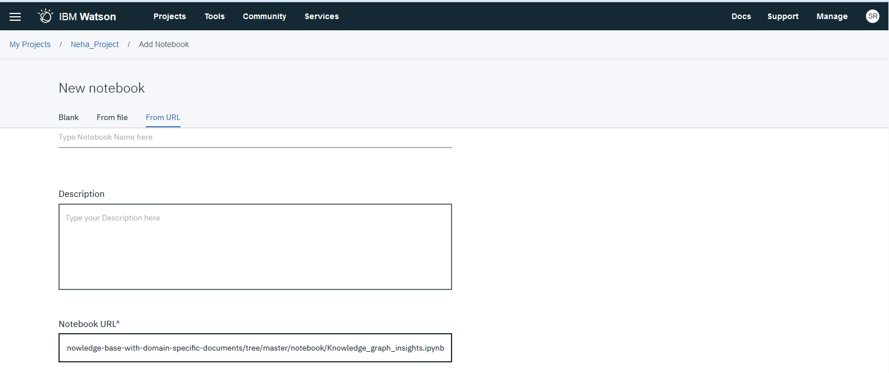
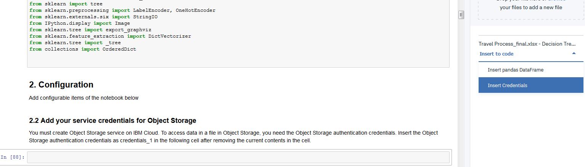
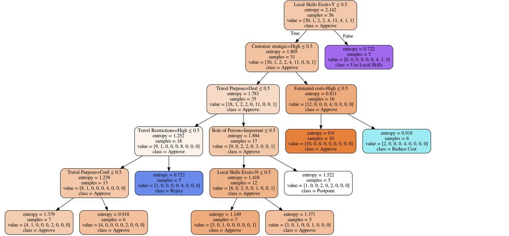
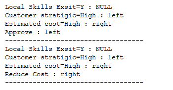
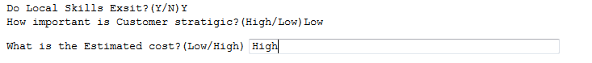
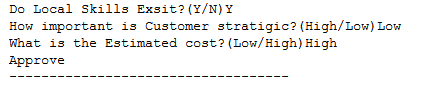

#  Automate the Decision-Making process using Machine learning with Minimal Manual Intervention

Decision-making is regarded as the cognitive process resulting in the selection of a belief or a course of action among several alternative possibilities. Every decision-making process produces a final choice or a recommendation.

In Multinational Companies, Banks or Hospitals, the decision-making process could be quite complex, difficult to manage and time-consuming. Hence resulting in a very cumbersome process.

This code pattern aims to automate and optimize any process of decision-making using Decision Tree Classification model with minimal manual intervention. Initially, the user enters the feature and its value. The Algorithm will look up the built Decision Tree model and will search for the optimal possible paths which can lead to the decision/ recommendation. Then, the system will start asking relevant questions from the user and based on the answers given by users. Finally, we get a recommendation.

This way, we reduce the manual intervention and complexity of any such Decision Making Process, thereby resulting in a generic solution to a complex problem.

When the reader has completed this code pattern, they will understand how to:

* Work with Pandas to preprocess, clean and deal with nans.
* Build Decision Tree Classification Model in Scikit-learn.
* Decode a built Decision Tree for traversal. 
* Find optimal possible paths leading to a final decision/ recommendation.
* Learn the Strategy to get the correct recommendations.

## Included components

* [IBM Watson Studio](https://www.ibm.com/cloud/watson-studio): Analyze data using RStudio, Jupyter, and Python in a configured, collaborative environment that includes IBM value-adds, such as managed Spark.

* [IBM Cloud Object Storage](https://console.bluemix.net/catalog/infrastructure/cloud-object-storage): An IBM Cloud service that provides an unstructured cloud data store to build and deliver cost effective apps and services with high reliability and fast speed to market.

* [Watson Natural Language Understanding](https://console.bluemix.net/catalog/services/natural-language-understanding/?cm_sp=dw-bluemix-_-code-_-devcenter): A IBM Cloud service that can analyze text to extract meta-data from content such as concepts, entities, keywords, categories, sentiment, emotion, relations, semantic roles, using natural language understanding.

## Featured technologies

* [Jupyter Notebooks](http://jupyter.org/): An open-source web application that allows you to create and share documents that contain live code, equations, visualizations and explanatory text.
* [Data Science](https://en.wikipedia.org/wiki/Data_science): An interdisciplinary field of scientific methods, processes, algorithms and systems to extract knowledge or insights from data in various forms, either structured or unstructured, similar to data mining
* [Decision Tree](http://dataaspirant.com/2017/01/30/how-decision-tree-algorithm-works/): To create a training model which can use to predict class or value of target variables by learning decision rules inferred from prior data

# Steps

Follow these steps to setup and run this code pattern. The steps are
described in detail below.

1. [Sign up for Watson Studio](#1-sign-up-for-watson-studio)
1. [Create the notebook](#2-create-the-notebook)
1. [Add the data and configuraton file](#3-add-the-data-and-configuration-file)
1. [Update the notebook with service credentials](#4-update-the-notebook-with-service-credentials)
1. [Run the notebook](#5-run-the-notebook)
1. [Analyze the results](#6-analyze-the-results)

## 1. Sign up for Watson Studio

Sign up for IBM's [Watson Studio](https://dataplatform.ibm.com). By creating a project in Watson Studio a free tier ``Object Storage`` service will be created in your IBM Cloud account. Take note of your service names as you will need to select them in the following steps.

> Note: When creating your Object Storage service, select the ``Free`` storage type in order to avoid having to pay an upgrade fee.

## 2. Create the notebook

* In [Watson Studio](https://dataplatform.ibm.com), click on `Create notebook` to create a notebook.
* Create a project if necessary, provisioning an object storage service if required.
* In the `Assets` tab, select the `Create notebook` option.
* Select the `From URL` tab.
* Enter a name for the notebook.
* Optionally, enter a description for the notebook.
* Enter this Notebook URL: https://github.com/IBM/watson-document-classifier/blob/master/notebooks/watson_document_classifier.ipynb
* Select the free Anaconda runtime.
* Click the `Create` button.

## 3. Add the data and configuration file

#### Add the data and configuration to the notebook

* From the `My Projects > Default` page, Use `Find and Add Data` (look for the `10/01` icon)
and its `Files` tab.
* Click `browse` and navigate to this repo `Travel-Process-Management/data/Travel Process_Final.csv`

> Note:  It is possible to use your own data files.

#### Fix-up file names for your own data and configuration files

If you use your own data and configuration files, you will need to update the variables that refer to the data and configuration files in the Jupyter Notebook.

In the notebook, update the global variables in the cell following `2.3 Global Variables` section.

Use the `questions` provided or create your own in the form of a key-value pair, key containing the features and the value containing the question to be asked.

Update `searchFeature` according to the desired feature asked by the user in the beginning of the chat chain.

## 4. Update the notebook with service credentials

* Select the cell below `2.2 Add your service credentials for Object Storage` section in the notebook to update the credentials for Object Store.
* Delete the contents of the cell
* Use `Find and Add Data` (look for the `10/01` icon) and its `Files` tab. You should see the file names uploaded earlier. Make sure your active cell is the empty one below `2.2 Add...`
* Select `Insert to code` (below your sample_text.txt).
* Click `Insert Crendentials` from drop down menu.
* Make sure the credentials are saved as `credentials_1`.

## 5. Run the notebook

When a notebook is executed, what is actually happening is that each code cell in
the notebook is executed, in order, from top to bottom.

> IMPORTANT: The first time you run your notebook, you will need to install the necessary
packages in section 1.1 and then `Restart the kernel`.

Each code cell is selectable and is preceded by a tag in the left margin. The tag
format is `In [x]:`. Depending on the state of the notebook, the `x` can be:

* A blank, this indicates that the cell has never been executed.
* A number, this number represents the relative order this code step was executed.
* A `*`, this indicates that the cell is currently executing.

There are several ways to execute the code cells in your notebook:

* One cell at a time.
  * Select the cell, and then press the `Play` button in the toolbar.
* Batch mode, in sequential order.
  * From the `Cell` menu bar, there are several options available. For example, you
    can `Run All` cells in your notebook, or you can `Run All Below`, that will
    start executing from the first cell under the currently selected cell, and then
    continue executing all cells that follow.
* At a scheduled time.
  * Press the `Schedule` button located in the top right section of your notebook
    panel. Here you can schedule your notebook to be executed once at some future
    time, or repeatedly at your specified interval.

## 6. Analyze the Results

After running the notebook, the given data is converted to a decision tree, as show in `8. Plotting the Decision Tree`.

Based on the `searchFeature` entered in `2.3 Global Variables` section, paths are retrieved.

Appropriate questions are asked in order for the tree to choose an appropriate path.

The user inputs determines the final target class

